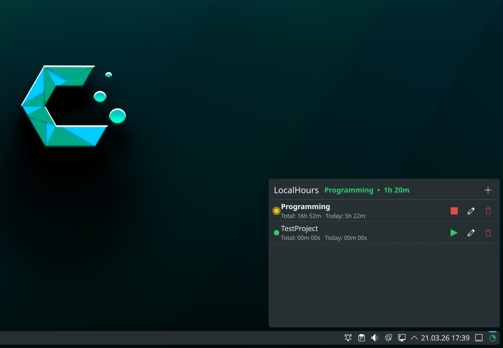

# LocalHours

LocalHours is a lightweight KDE Plasma 6 panel widget for tracking project time locally.  
It uses a small Python daemon over D-Bus, stores data on disk in JSON, and avoids cloud services by default.

## Features

- Start/stop time tracking per project from the panel popup
- Per-project metrics (total, today, week, month)
- Project editing (name, color, displayed metrics)
- Session history editing and deletion
- Safety cap for long-running sessions (`maxSessionHours`)
- Local-first storage (`~/.local/share/localhours/data.json` by default)

## Screenshots

- Add a compact-panel screenshot here
- Add the project list popup screenshot here
- Add the edit-project/session-history screenshot here

Example placeholder format:

```markdown

```

## Requirements

- KDE Plasma 6
- `kpackagetool6`
- `systemd --user`
- Python 3.10+
- Python packages for backend:
  - `pydbus`
  - `PyGObject` / `gi`

## Installation

From the repository root:

```bash
./install.sh
```

The installer performs:

1. Dependency checks
2. Widget package install via `kpackagetool6`
3. User service install and start (`localhours.service`)
4. D-Bus responsiveness check

## Python Dependency Strategy

Preferred package sources:

- Arch/CachyOS/Manjaro:
  - `sudo pacman -S python-pydbus python-gobject`
- Debian/Ubuntu:
  - `sudo apt install python3-pydbus python3-gi`

The installer does **not** use `pip --break-system-packages` by default.

If distro packages are unavailable and you intentionally want that fallback, opt in explicitly:

```bash
LOCALHOURS_ALLOW_BREAK_SYSTEM_PACKAGES=1 ./install.sh
```

## Updating an Existing Installation

You can update in place (no uninstall required):

```bash
./install.sh
```

This reinstalls the plasmoid package and refreshes the user service.  
Tracked data is preserved unless you explicitly remove it during uninstall.

If UI changes do not appear immediately, restart Plasma shell:

```bash
kquitapp6 plasmashell && kstart6 plasmashell
```

## Uninstall

```bash
./uninstall.sh
```

The script asks whether to keep or remove tracked data.

## Usage

1. Add the `LocalHours` widget to your panel/system tray.
2. Open the popup.
3. Create a project.
4. Start and stop tracking with the row action button.
5. Edit project details/sessions from the edit view.

## Configuration

From widget settings:

- `dataFilePath`: custom JSON location (empty resets to default path)
- `maxSessionHours`: failsafe cap for long-running sessions (`0` disables cap)

Behavior notes:

- Settings are applied immediately while the daemon is running.
- If daemon is stopped, settings apply on next start.

## Data and Privacy

- Default data file: `~/.local/share/localhours/data.json`
- All tracking data stays local by default
- No external API or cloud sync is required
- You can point the data file to a synced folder manually if desired

## Architecture

- UI: QML plasmoid (`plasmoid/package/contents/ui/*.qml`)
- Bridge: Plasma executable data engine runs `tracker-client.py`
- Backend daemon: `daemon.py` (D-Bus service `org.kde.plasma.localhours`)
- Service manager: systemd user unit (`localhours.service`)
- Persistence: local JSON file on disk

## Troubleshooting

Check service status:

```bash
systemctl --user status localhours
```

Restart backend service:

```bash
systemctl --user restart localhours
```

Tail daemon logs:

```bash
journalctl --user -u localhours -f
```

Check D-Bus endpoint:

```bash
gdbus introspect --session --dest org.kde.plasma.localhours --object-path /org/kde/plasma/localhours
```

If the widget cannot talk to daemon:

- Ensure required Python packages are importable by `python3`
- Verify service file exists at `~/.config/systemd/user/localhours.service`
- Run `systemctl --user daemon-reload` after service changes

## Contributing

Contributions are welcome via issues and pull requests.

Suggested workflow:

1. Create a topic branch
2. Make focused commits with clear messages
3. Include reproduction/verification steps in PR description
4. Keep UI and backend behavior consistent (QML + daemon contracts)

## Release and Versioning

Current widget version is tracked in:

- `plasmoid/package/metadata.json` (`KPlugin.Version`)

Before publishing a release:

1. Run install/update/uninstall smoke checks
2. Verify service startup and D-Bus introspection
3. Validate settings behavior and session edit flows
4. Update changelog/release notes
5. Tag release in Git

## License

This project is licensed under the MIT License.  
See [LICENSE](LICENSE) for the full text.
